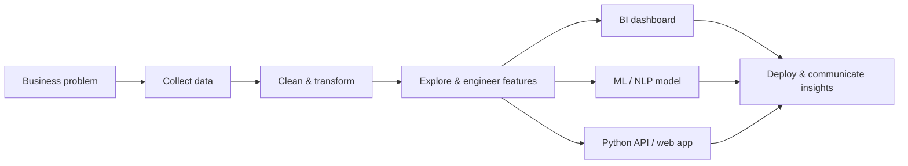

  

  
  
  
  

  
  
  
  

  <a href="#professional-profile">Profile</a> •
  <a href="#technical-skills">Skills</a> •
  <a href="#featured-projects">Projects</a> •
  <a href="#training--experience">Experience</a> •
  <a href="#education">Education</a> •
  <a href="#github-analytics">Analytics</a> •
  <a href="#contact">Contact</a>

---

## Professional Profile

Computer Science & Engineering graduate with hands-on experience across **data analytics, machine learning, Python backend development, business intelligence, and full-stack web development**. I build end-to-end solutions—from cleaning and analyzing data to developing ML models, dashboards, REST APIs, and deployed web applications.

- 🔭 **Currently:** Data Science & Full-Stack Web Development Trainee at **QSpiders**, Bengaluru
- 🎯 **Seeking:** Entry-level **Data Analyst, Python Developer, Machine Learning Engineer, or BI Developer** opportunities
- 💡 **Strengths:** Analytical problem-solving, clean implementation, secure data workflows, and clear communication of business insights
- 🤝 **Interested in:** Data-driven products, Python automation, analytics dashboards, applied AI/ML, and open-source collaboration

### How I turn problems into solutions

---

## Technical Skills

  
  
  
  
  
  
  
  
  
  
  

| Area | Skills |
|---|---|
| **Programming** | Python, SQL, JavaScript, HTML5, CSS3, OOP, DSA |
| **Data Analytics** | Data cleaning, transformation, preprocessing, EDA, feature engineering, statistical analysis, KPI analysis, visualization |
| **Business Intelligence** | Power BI, Excel, Power Query, DAX, Pivot Tables/Charts, lookup functions, conditional formatting, KPI reporting |
| **Machine Learning & AI** | Classification, regression, clustering, Logistic/Linear Regression, Decision Trees, Random Forest, KNN, SVM, NLP, LLM integration, prompt engineering |
| **ML Workflow** | Feature selection, model evaluation, cross-validation, hyperparameter tuning, GridSearchCV, pipelines, model persistence |
| **Python Ecosystem** | Pandas, NumPy, Matplotlib, Seaborn, Scikit-learn, Requests, BeautifulSoup |
| **Backend & Web** | Django, Flask, Node.js, Express.js, Streamlit, REST APIs, JSON, CRUD, authentication/authorization, API integration/testing |
| **Frontend** | React.js, Redux Toolkit, Bootstrap, Tailwind CSS, Material UI, responsive design, DOM manipulation, form validation |
| **Databases** | MySQL, PostgreSQL, Oracle SQL, SQLite, MongoDB, database operations and relational modeling |
| **Tools** | Git, GitHub, VS Code, Jupyter Notebook, Google Colab, Postman, Thunder Client, Chrome DevTools |
| **Deployment** | Streamlit Cloud, GitHub Pages, Netlify, Vercel, Render, Railway, Docker, Gunicorn, WhiteNoise |
| **Engineering Practices** | Version control, debugging, data encryption, secure workflows, modular architecture, API testing |

---

## Featured Projects

> Projects are organized by career track so recruiters can quickly review the work most relevant to their role.

| Project | Problem & solution | Core stack | Links |
|---|---|---|---|
| **Natural Language Data Filtering & Visualization** | Converts English/Hinglish questions into safe Pandas filters and charts, with AST validation and automatic error correction. | Python, Streamlit, Pandas, Hugging Face, Qwen 2.5 Coder, AST | [Live Demo](https://natural-language-data-filtering-visualization-system-mszijrgml.streamlit.app/) · [Repository](https://github.com/GauravBaba3/Natural-Language-Data-Filtering-Visualization-System) |
| **AI Resume Screening System** | Parses PDF resumes, predicts job compatibility, and produces structured LLM-assisted candidate evaluations. | Python, TF-IDF, Random Forest, GridSearchCV, Streamlit, Ollama | [Repository](https://github.com/GauravBaba3/Resume-Screening-System) |
| **Prompt Evaluation Studio Pro** | Evaluates, compares, versions, and optimizes prompts with authentication, analytics, and multi-format exports. | Python, Streamlit, Gemini API, SQLAlchemy, Plotly, Docker | [Live Demo](https://prompt-evaluation-studio-pro-kbtghkyzchfcbqez97idy6.streamlit.app/) · [Repository](https://github.com/GauravBaba3/Prompt-Evaluation-Studio-Pro) |
| **Hospital Management System** | Digitizes registration, appointments, lab reports, discharge, and billing with secure role-based workflows. | Python, Django, SQLite, Bootstrap 5, reCAPTCHA, Gunicorn | [Live Demo](https://hospital-management-system-1t64.onrender.com/) · [Repository](https://github.com/GauravBaba3/Hospital-Management-System) |
| **WriteWaves Blog System** | Full-stack blogging platform with JWT authentication, CRUD, comments, likes, search, filters, and pagination. | Django REST Framework, React, Redux Toolkit, Axios, JWT | [Live Demo](https://writewaves.netlify.app/) · [Repository](https://github.com/GauravBaba3/Blog-System) |
| **Power BI Analytics Portfolio** | Interactive dashboards for HR, retail, vehicle sales, attrition, KPIs, and regional/business performance. | Power BI, Power Query, DAX, Excel, data modeling | [Repository](https://github.com/GauravBaba3/Power-Bi-Projects) |

<b>View the complete project directory by role</b>

### Data Analyst / BI Developer

- [Natural Language Data Filtering & Visualization](https://natural-language-data-filtering-visualization-system-mszijrgml.streamlit.app/) — conversational analysis for CSV/Excel data with dynamic charts
- [HR Analytics Dashboard](https://github.com/GauravBaba3/Power-Bi-Projects/blob/main/Hr_analytics_dashboard.pbix) — attrition, job-role, salary, demographics, and KPI analysis
- [BMW Sales Dashboard](https://github.com/GauravBaba3/Power-Bi-Projects/blob/main/bmw%20car%20dashbaord%20project%202.pbix) — revenue, pricing, models, regions, fuel types, and yearly trends
- [Blinkit Sales Dashboard](https://github.com/GauravBaba3/Power-Bi-Projects/blob/main/blinkit%20project.pbix) — outlet, product category, customer rating, and sales performance
- [Employee Dashboard](https://github.com/GauravBaba3/Power-Bi-Projects) — workforce distribution, salary, experience, gender, and department analysis
- [Employee Attrition Dashboard](https://github.com/GauravBaba3/Power-Bi-Projects/blob/main/emp_attrition%20analysis%20project%203.pbix) — turnover patterns, high-risk groups, satisfaction, and retention KPIs
- [Super Store Sales Dashboard](https://github.com/GauravBaba3/Power-Bi-Projects/blob/main/super%20store%20sales.pbix) — sales, profit, customer segment, category, region, and shipping analysis
- [Vrinda Store Sales Analysis](https://github.com/GauravBaba3/Excel-projects/blob/master/Vrinda%20Store%20Data%20Analysis.xlsx) — Excel dashboard for channels, customer segments, orders, and state-wise sales

### Machine Learning / AI

- [Resume Screening System](https://github.com/GauravBaba3/Resume-Screening-System) — TF-IDF, Random Forest, GridSearchCV, PDF extraction, and LLM recommendations
- [Breast Cancer Prediction](https://github.com/GauravBaba3/breast_cancer_model) — classification workflow covering EDA, preprocessing, feature selection, training, and evaluation
- [Prompt Evaluation Studio Pro](https://github.com/GauravBaba3/Prompt-Evaluation-Studio-Pro) — Gemini-powered prompt evaluation, optimization, comparison, analytics, and version control

### Python / Full-Stack Development

- [Hospital Management System](https://github.com/GauravBaba3/Hospital-Management-System) — Django modules for patients, doctors, appointments, labs, billing, and discharge
- [WriteWaves Blog System](https://github.com/GauravBaba3/Blog-System) — React + Django REST Framework application with JWT-secured APIs
- [Natural Language Data Filtering & Visualization](https://github.com/GauravBaba3/Natural-Language-Data-Filtering-Visualization-System) — modular preprocessing, LLM routing, secure execution, and Streamlit UI

---

## Training & Experience

| Period | Organization & role | Highlights |
|---|---|---|
| **Aug 2025 – Present** | **QSpiders, Bengaluru** — Data Science & Full-Stack Web Development Trainee | Python, SQL, ML, analytics, Power BI, Excel, Django, Flask, Streamlit, React, REST APIs, databases, LLM/NLP applications, and deployment |
| **Feb 2025 – Mar 2025** | **NSIC Technical Services Centre, Chennai** — Web Development Intern | Built responsive interfaces with HTML, CSS, JavaScript, and Bootstrap; practiced Git workflows, UI design, and deployment fundamentals |
| **Feb 2024 – Mar 2024** | **Internship Studio** — Frontend Web Developer Trainee | Developed React interfaces using components, hooks, state, and props; focused on mobile-first design, performance, and cross-browser support |
| **Dec 2023 – Jan 2024** | **CodeAlpha** — Frontend Web Developer Trainee | Built a browser code editor, task scheduler, and issue tracker using HTML, CSS, JavaScript, and Bootstrap |
| **Sep 2023 – Oct 2023** | **Bharat Intern** — Frontend Web Developer Trainee | Delivered responsive React UI modules, form handling, dynamic updates, bug fixes, and Git-based collaboration |
| **Jul 2023** | **freeCodeCamp** — Frontend Web Development Training | Built responsive pages and interactive components using HTML5, CSS3, JavaScript, Bootstrap, Flexbox, and CSS Grid |

---

## Education

**Bachelor of Engineering — Computer Science & Engineering**  
Dhanalakshmi Srinivasan Engineering College, Perambalur · Anna University  
**2021–2025 · CGPA: 7.57/10**

Coursework and practical exposure included programming, databases, web technologies, software engineering, artificial intelligence, machine learning, and analytics.

<b>Earlier education</b>

- **Higher Secondary (2019–2021):** Mahesh Singh Yadav College, Gaya — Mathematics and Science · 63%
- **Secondary Education (2019):** High School — 63%

---

## Certifications

<b>View certifications and professional learning</b>

### Data Analytics & Business Intelligence
- Data Analytics & Visualization Job Simulation — Accenture / Forage
- Data Analytics Job Simulation — Deloitte / Forage
- Data Visualisation: Empowering Business with Effective Insights — Tata / Forage
- Google Analytics Certification
- Analyzing & Visualizing IoT Data on AWS

### Machine Learning, AI & Python
- Introduction to Python — DataCamp
- Introduction to Machine Learning — Infosys Springboard
- Fundamentals of Generative AI — Microsoft Learn
- Use AutoML to Train a Labeled Dataset and Develop a Production Model — Microsoft Learn
- AI for India 2.0 — GUVI / Skill India
- CRUD Application Using Python Workshop — Livewire
- Simple Coding Using Python — Open University

### Software Engineering & Web Development
- Software Engineering Job Simulation — JPMorgan Chase / Forage
- Programming Foundations Fundamentals — LinkedIn Learning
- Responsive Web Design — freeCodeCamp
- Web Development Internship Certificate — Edureka
- JavaScript Bootcamp — LetsUpgrade
- SDLC: Waterfall Model — Great Learning

<a href="https://github.com/GauravBaba3/my-certificates"><b>View certificate repository →</b></a>

---

## GitHub Analytics

  
  

  

  

Language statistics reflect the composition of public repositories and are not a measure of proficiency.

---

## Languages

- **Hindi:** Native / Bilingual
- **English:** Professional Working Proficiency
- **Tamil:** Basic

---

## Contact

  I am open to entry-level opportunities, collaborative projects, and meaningful conversations about data, Python, AI/ML, and business intelligence.

  <a href="mailto:gaurav.kumar.jobs.2003@gmail.com"><b>Email</b></a> •
  <a href="tel:+917481812280"><b>Phone: +91 7481812280</b></a> •
  <a href="https://www.linkedin.com/in/gauravkumar311/"><b>LinkedIn</b></a> •
  <a href="https://gaurav-kumar-311.netlify.app/"><b>Portfolio</b></a> •
  <a href="https://github.com/GauravBaba3"><b>GitHub</b></a>

  <b>Bengaluru, Karnataka, India</b>

<i>Turning raw data into decisions—and ideas into useful products.</i>

